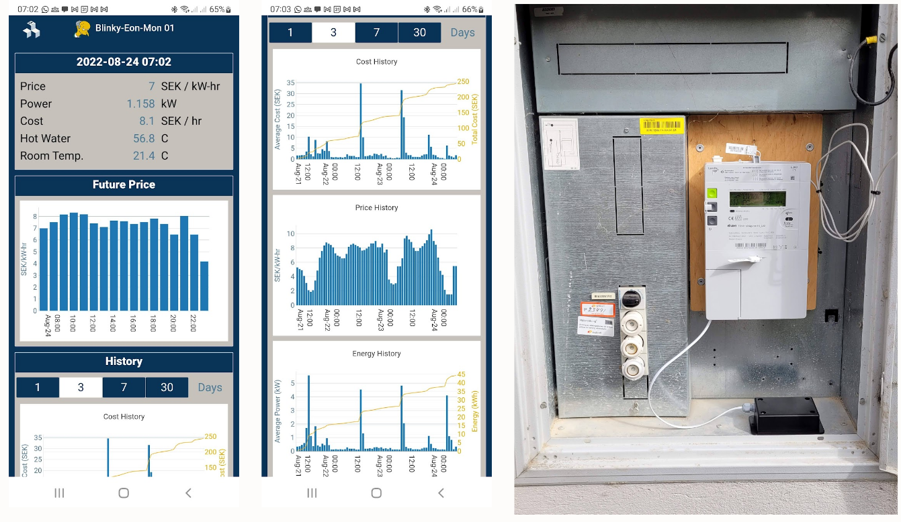

# Blinky Eon Mon Tray
Identifying how much energy usage and when it used is key to figuring out how to reduce costs. Sweden is mandating that all home electricity meters be updated to smart meters equipped with a P1-HAN interface. Many electricity providers offer their own P1-HAN interface but require use of their web service which can be invasive and especially limiting on the display functionality and update rate. Unlike commercial providers, the Blinky Eon Mon  can also be used actively as a feedback device to control usage to other devices in the Blinky-Lite system..

Blinky Eon Mon is a very simple, low cost device for decoding the P1-HAN interface. The smart electric meter with the P1-HAN interface is connected to the [Blinky Eon Mon cube](https://github.com/blinky-lite-energy-exchange/blinky-eon-mon-cube) with an RJ12 connector. The Blinky Eon Mon cube reads the serial data provide by the  smart electric meter.

The Blinky Eon Mon tray transmits the energy usage  to the Blinky-Lite application box server for display and archival. The Blinky Eon Mon tray uses the Blinky-Bus interface to communicate serially with the Blinky Eon Mon cube. The serial communication in this tray is done over Bluetooth. The tray code is derived from the [Blinky-Bus tray](https://github.com/Blinky-Lite-Exchange/blinky-bus-tray) project

 
